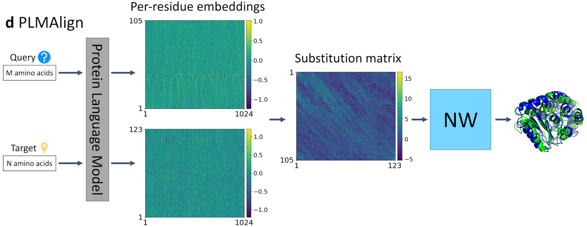

# PLMAlign

This is the implement of <b>PLMAlign</b>, an alignment tool in "PLMSearch: Protein language model powers accurate and fast sequence search for remote homology". PLMAlign takes amino acid-level embeddings as input to obtain specific alignments and more refined similarity.

Specifically, PLMAlign can achieve <b>local</b> and <b>global</b> alignment. The specific algorithm and parameters are similar to the [SW](https://www.ebi.ac.uk/Tools/psa/emboss_water/) and [NW](https://www.ebi.ac.uk/Tools/psa/emboss_needle/) algorithm implemented by [EMBL-EBI](https://www.ebi.ac.uk/). However, by converting a fixed substitution matrix into similarity calculated by the dot product of amino acid-level embeddings, PLMAlign is able to capture deep evolutionary information and perform better on remote homology protein pairs.

<div align=center></div>

## Quick links

* [Webserver](#webserver)
* [Requirements](#requirements)
* [Data preparation](#data-preparation)
* [Reproduce all our experiments](#main)
* [Build PLMSearch locally](#pipeline)
* [Citation](#citation)

## Webserver
<span id="webserver"></span>

Search your protein sequences in seconds using PLMSearch webserver: [dmiip.sjtu.edu.cn/PLMSearch/](https://dmiip.sjtu.edu.cn/PLMSearch/) 🚀

## Requirements
<span id="requirements"></span>

Follow the steps in [requirements.sh](requirements.sh).

## Data preparation
<span id="data-preparation"></span>

We have released our experiment data in [plmalign_data](https://dmiip.sjtu.edu.cn/PLMAlign/static/download/plmalign_data.tar.gz).
```bash
wget https://dmiip.sjtu.edu.cn/PLMSearch/static/download/plmalign_data.tar.gz
tar zxvf plmalign_data.tar.gz
```

## Run PLMAlign
<span id="pipeline"></span>

PLMAlign   webserver : [dmiip.sjtu.edu.cn/PLMAlign](https://dmiip.sjtu.edu.cn/PLMAlign/) :airplane:

PLMSearch  webserver : [dmiip.sjtu.edu.cn/PLMSearch](https://dmiip.sjtu.edu.cn/PLMSearch/) 🚀

PLMSearch source code : [github.com/maovshao/PLMSearch](https://github.com/maovshao/PLMSearch/) :helicopter:

**Notice: the inputs and outputs of the example are saved in** `example/`.

## Reproduce all our experiments
<span id="main"></span>

Reproduce all our experiments with good visualization by following the steps in:
- Malidup: [malidup.ipynb](malidup.ipynb).
- Malisam: [malisam.ipynb](malisam.ipynb).

**Notice: Detailed results are saved in** `data/alignment_benchmark/result/`.

- SCOPe40: [scope40.ipynb](scope40.ipynb).

**Notice: Detailed results are saved in** `data/scope40_test/output/`.

## Citation
<span id="citation"></span>
If you find the tool useful in your research, we ask that you cite the relevant paper:
```bibtex
@article {Liu2023.04.03.535375,
  author = {Liu, Wei and Wang, Ziye and You, Ronghui and Xie, Chenghan and Wei, Hong and Xiong, Yi and Yang, Jianyi and Zhu, Shanfeng},
  title = {Protein language model powers accurate and fast sequence search for remote homology},
  year = {2023},
  doi = {10.1101/2023.04.03.535375},
  URL = {https://www.biorxiv.org/content/early/2023/04/05/2023.04.03.535375},
  journal = {bioRxiv}
}
```
